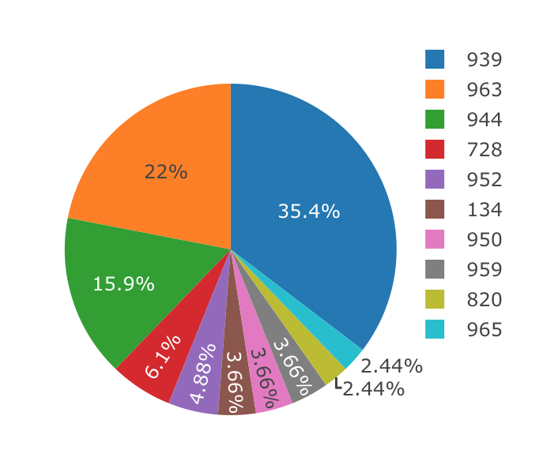
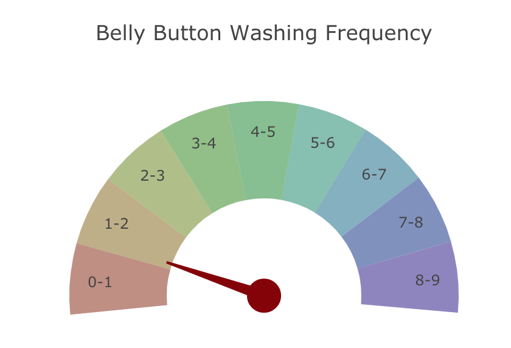
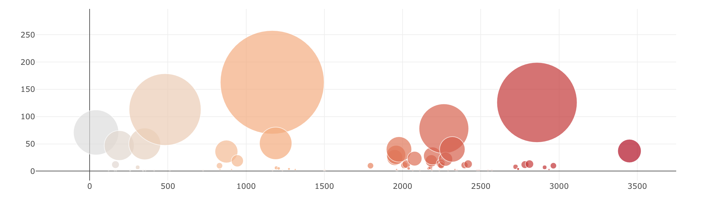

## Belly Button Biodiversity 

# Description 
I created a dashboard with three charts showing the biodiversity that exists within belly buttons. I used Plotly.js to create a pie chart, gauge, and a bubble chart. 
The user can select a bacterial sample from the dropdown menu. Once selected, the data is fetched using flask-sqlalchemy. After the sample data is collected, it generates the pie chart, the bubble chart, and the gauge chart. Whent the user changes the bacteria sample, the charts update with the new information. 

The pie chart represents the breakdown of the top ten samples. 

The guage shows how freqently the belly button was washed. The pointer shifts when a new bacteria is selected from the dropdown. 

The bubble chart represents the samples, with larger bubbles showing a greater sample value. 

# Prerequisites
The CDNs for D3, Plotly.js, and Bootstrap are linked in index.html. Source data can be found in db/bellybutton.sqlite. 

# Built With
* Javascript
* D3.js
* HTML 5.0
* Bootstrap
* Plotly.js
* Flask-sqlalchemy
* Pandas
